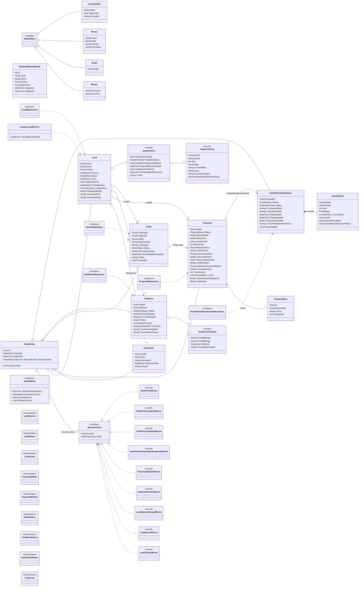

# Diagrama de classes (Commercial)

> Foco no modelo de domínio do serviço **GestAuto.Commercial** (entidades, value objects, eventos e contratos de repositório).

```mermaid
classDiagram
    direction LR

    %% ===============
    %% Base
    %% ===============
    class BaseEntity {
        +Guid Id
        +DateTime CreatedAt
        +DateTime UpdatedAt
        +IReadOnlyCollection~IDomainEvent~ DomainEvents
        +void ClearEvents()
    }

    class IDomainEvent {
        <<interface>>
        +Guid EventId
        +DateTime OccurredAt
    }

    BaseEntity "1" o-- "0..*" IDomainEvent : DomainEvents

    %% ===============
    %% Entidades (Domain)
    %% ===============
    class Lead {
        +string Name
        +Email Email
        +Phone Phone
        +LeadSource Source
        +LeadStatus Status
        +LeadScore Score
        +Guid SalesPersonId
        +Qualification? Qualification
        +List~Interaction~ Interactions
        +string? InterestedModel
        +string? InterestedTrim
        +string? InterestedColor
    }

    class Interaction {
        +Guid LeadId
        +string Type
        +string Description
        +DateTime InteractionDate
        +string? Result
    }

    class Proposal {
        +Guid LeadId
        +ProposalStatus Status
        +string VehicleModel
        +string VehicleTrim
        +string VehicleColor
        +int VehicleYear
        +bool IsReadyDelivery
        +Money VehiclePrice
        +Money DiscountAmount
        +string? DiscountReason
        +Guid? DiscountApproverId
        +Money TradeInValue
        +PaymentMethod PaymentMethod
        +Money? DownPayment
        +int? Installments
        +List~ProposalItem~ Items
        +Guid? UsedVehicleEvaluationId
        +Money TotalValue
    }

    class ProposalItem {
        +Guid Id
        +string Description
        +Money Price
        +bool IsOptional
    }

    class Order {
        +Guid? ExternalId
        +Guid ProposalId
        +Guid LeadId
        +string OrderNumber
        +Money TotalValue
        +OrderStatus Status
        +DateTime? DeliveryDate
        +DateTime? EstimatedDeliveryDate
        +string? Notes
        +Guid CreatedBy
    }

    class TestDrive {
        +Guid LeadId
        +Guid VehicleId
        +TestDriveStatus Status
        +DateTime ScheduledAt
        +DateTime? CompletedAt
        +string? Notes
        +Guid SalesPersonId
        +TestDriveChecklist? Checklist
        +string? CustomerFeedback
        +string? CancellationReason
    }

    class UsedVehicleEvaluation {
        +Guid ProposalId
        +UsedVehicle Vehicle
        +EvaluationStatus Status
        +Money? EvaluatedValue
        +string? EvaluationNotes
        +DateTime RequestedAt
        +DateTime? RespondedAt
        +bool? CustomerAccepted
        +string? CustomerRejectionReason
        +Guid RequestedBy
    }

    class UsedVehicle {
        +string Brand
        +string Model
        +int Year
        +int Mileage
        +LicensePlate LicensePlate
        +string Color
        +string GeneralCondition
        +bool HasDealershipServiceHistory
    }

    class PaymentMethodEntity {
        +int Id
        +string Code
        +string Name
        +bool IsActive
        +int DisplayOrder
        +DateTime CreatedAt
        +DateTime UpdatedAt
    }

    BaseEntity <|-- Lead
    BaseEntity <|-- Interaction
    BaseEntity <|-- Proposal
    BaseEntity <|-- Order
    BaseEntity <|-- TestDrive
    BaseEntity <|-- UsedVehicleEvaluation

    Lead "1" o-- "0..*" Interaction : Interactions
    Lead "1" --> "0..*" Proposal : LeadId
    Lead "1" --> "0..*" TestDrive : LeadId
    Lead "1" --> "0..*" Order : LeadId

    Proposal "1" o-- "0..*" ProposalItem : Items
    Proposal "1" --> "0..1" UsedVehicleEvaluation : UsedVehicleEvaluationId
    Order "0..*" --> "1" Proposal : ProposalId

    UsedVehicleEvaluation *-- UsedVehicle : Vehicle

    %% ===============
    %% Value Objects
    %% ===============
    class ValueObject {
        <<abstract>>
    }

    class Money {
        +decimal Amount
        +string Currency
    }

    class Email {
        +string Value
    }

    class Phone {
        +string Value
        +string DDD
        +string Number
        +string Formatted
    }

    class LicensePlate {
        +string Value
        +bool IsMercosul
        +string Formatted
    }

    class Qualification {
        <<record>>
        +bool HasTradeInVehicle
        +TradeInVehicle? TradeInVehicle
        +PaymentMethod PaymentMethod
        +DateTime ExpectedPurchaseDate
        +bool InterestedInTestDrive
        +decimal? EstimatedMonthlyIncome
        +string? Notes
    }

    class TradeInVehicle {
        <<record>>
        +string Brand
        +string Model
        +int Year
        +int Mileage
        +string LicensePlate
        +string Color
        +string GeneralCondition
        +bool HasDealershipServiceHistory
    }

    class TestDriveChecklist {
        <<record>>
        +decimal InitialMileage
        +decimal FinalMileage
        +FuelLevel FuelLevel
        +string? VisualObservations
    }

    ValueObject <|-- Money
    ValueObject <|-- Email
    ValueObject <|-- Phone
    ValueObject <|-- LicensePlate

    Lead "1" o-- "0..1" Qualification
    Qualification "1" o-- "0..1" TradeInVehicle
    TestDrive "1" o-- "0..1" TestDriveChecklist

    %% ===============
    %% Serviços de domínio
    %% ===============
    class LeadScoringService {
        +LeadScore Calculate(Lead lead)
    }

    LeadScoringService ..> Lead

    %% ===============
    %% Repositórios / UoW
    %% ===============
    class ILeadRepository {
        <<interface>>
    }
    class IProposalRepository {
        <<interface>>
    }
    class IOrderRepository {
        <<interface>>
    }
    class ITestDriveRepository {
        <<interface>>
    }
    class IUsedVehicleEvaluationRepository {
        <<interface>>
    }
    class IUnitOfWork {
        <<interface>>
        +Task~int~ SaveChangesAsync()
        +Task BeginTransactionAsync()
        +Task CommitAsync()
        +Task RollbackAsync()
    }

    ILeadRepository ..> Lead
    IProposalRepository ..> Proposal
    IOrderRepository ..> Order
    ITestDriveRepository ..> TestDrive
    IUsedVehicleEvaluationRepository ..> UsedVehicleEvaluation

    %% ===============
    %% Eventos
    %% ===============
    class LeadCreatedEvent {
        <<record>>
    }
    class LeadScoredEvent {
        <<record>>
    }
    class LeadStatusChangedEvent {
        <<record>>
    }
    class ProposalCreatedEvent {
        <<record>>
    }
    class ProposalUpdatedEvent {
        <<record>>
    }
    class UsedVehicleEvaluationRequestedEvent {
        <<record>>
    }
    class TestDriveScheduledEvent {
        <<record>>
    }
    class TestDriveCompletedEvent {
        <<record>>
    }
    class SaleClosedEvent {
        <<record>>
    }

    IDomainEvent <|.. LeadCreatedEvent
    IDomainEvent <|.. LeadScoredEvent
    IDomainEvent <|.. LeadStatusChangedEvent
    IDomainEvent <|.. ProposalCreatedEvent
    IDomainEvent <|.. ProposalUpdatedEvent
    IDomainEvent <|.. UsedVehicleEvaluationRequestedEvent
    IDomainEvent <|.. TestDriveScheduledEvent
    IDomainEvent <|.. TestDriveCompletedEvent
    IDomainEvent <|.. SaleClosedEvent

    %% ===============
    %% Enums
    %% ===============
    class LeadSource {
        <<enumeration>>
    }
    class LeadStatus {
        <<enumeration>>
    }
    class LeadScore {
        <<enumeration>>
    }
    class ProposalStatus {
        <<enumeration>>
    }
    class PaymentMethod {
        <<enumeration>>
    }
    class OrderStatus {
        <<enumeration>>
    }
    class TestDriveStatus {
        <<enumeration>>
    }
    class EvaluationStatus {
        <<enumeration>>
    }
    class FuelLevel {
        <<enumeration>>
    }
```
