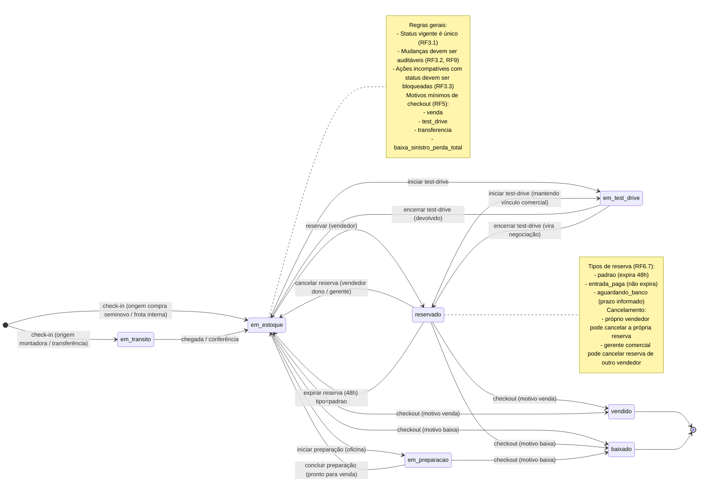

# Diagrama Mermaid — Módulo de Estoque (Veículos)

Este diagrama representa os **status vigentes** do veículo no estoque e as **transições principais** descritas no PRD (check-in, reserva, test-drive, preparação, venda e baixa).

